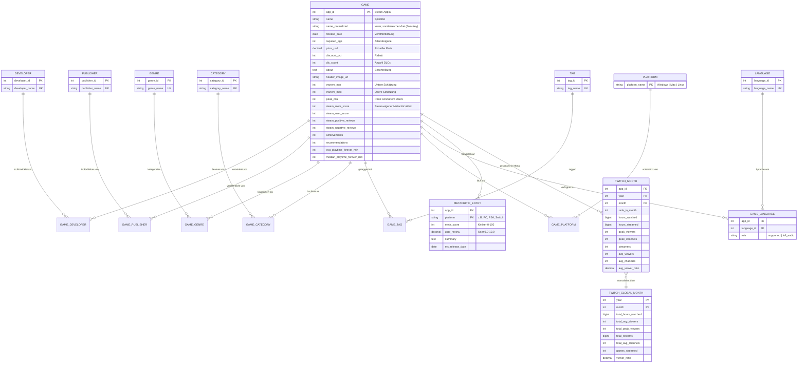

# Konzeptionelles Datenmodell — Game Hype Index

Reverse-Engineering aus drei Quellen (Steam, Twitch, Metacritic), integriert über den normalisierten Spieltitel. Steam bildet den **Hub** mit der eindeutigen `AppID` als technischem Primärschlüssel.

## 1. Entitäten und ihre fachliche Bedeutung

| Entität | Quelle | Bedeutung | Identifikation |
|---|---|---|---|
| **Game** | Steam (Hub) | Ein verkaufbares Spiel auf Steam — alle Stammdaten | `AppID` (natürlich) |
| **Developer** | Steam (Spalte `Developers`, komma-sep.) | Entwicklerstudio | `developer_name` (natürlich) → Surrogat-ID |
| **Publisher** | Steam (Spalte `Publishers`, komma-sep.) | Vertriebsfirma | `publisher_name` → Surrogat-ID |
| **Genre** | Steam (Spalte `Genres`, komma-sep.) | Steam-Hauptgenre (z.B. „Action") | `genre_name` → Surrogat-ID |
| **Category** | Steam (Spalte `Categories`, komma-sep.) | Steam-Feature („Single-player", „VR Support") | `category_name` → Surrogat-ID |
| **Tag** | Steam (Spalte `Tags`, komma-sep.) | Community-Tag („Roguelike", „Pixel Graphics") | `tag_name` → Surrogat-ID |
| **Language** | Steam (Spalten `Supported_languages`, `Full_audio_languages`) | Sprache mit Rolle „supported" oder „full_audio" | `language_name` → Surrogat-ID |
| **Platform** | Steam (Boolean-Spalten `Windows/Mac/Linux`) | Betriebssystem-Support | `platform_name` (Enum) |
| **MetacriticEntry** | Metacritic `all_games.csv` | Kritiker- und User-Bewertung **pro Spiel pro Plattform** (Multi-Platform: PC, PS4, Switch …) | `(game_id, platform)` |
| **TwitchMonth** | Twitch `Twitch_game_data.csv` | Streaming-Kennzahlen eines Spiels in einem Monat (Faktentabelle, Zeitreihe) | `(game_id, year, month)` |
| **TwitchGlobalMonth** | Twitch `Twitch_global_data.csv` | Plattform-Aggregate pro Monat (für Anteils-Normalisierung) | `(year, month)` |

### Abgeleitete / aufzubereitende Felder

- `Estimated owners` ist im Original ein Bereichs-String („20000 - 50000"). Wird in der ELT-Transformation in `owners_min` (INT) und `owners_max` (INT) zerlegt.
- `Release date` ist ein Freitext-Datum („Aug 1, 2023"). Parsing in DATE im Transformations-Schritt.
- `Supported languages` / `Full audio languages` sind als JSON-ähnliche Listen-Strings (`['English','German']`) gespeichert → JSON-Parse beim Laden.
- `Developers`, `Publishers`, `Genres`, `Categories`, `Tags` sind komma-separierte Strings → explodiert in M:N-Beziehungstabellen.
- `Movies` ist im CSV durchgehend leer (Parser-Artefakt) → wird im Schema weggelassen, in MongoDB aus dem JSON ergänzt.

## 2. ER-Diagramm (konzeptionell)



> Hinweis: Die reinen Junction-Tabellen `GAME_DEVELOPER`, `GAME_PUBLISHER`, `GAME_GENRE`, `GAME_CATEGORY`, `GAME_TAG`, `GAME_PLATFORM` sind aus Platzgründen ohne eigene Attribut-Box dargestellt; sie enthalten jeweils nur die beiden Fremdschlüssel als zusammengesetzten Primärschlüssel.

## 3. Beziehungen — Kardinalitäten und Begründung

| Beziehung | Kardinalität | Begründung |
|---|---|---|
| Game ↔ Developer | M:N | Ein Spiel kann mehrere Co-Developer haben; ein Studio macht viele Spiele. |
| Game ↔ Publisher | M:N | Selbes Muster wie Developer (Co-Publishing kommt vor). |
| Game ↔ Genre | M:N | Steam erlaubt mehrere Genres („Action, RPG"). |
| Game ↔ Category | M:N | „Single-player, Multi-player, Steam Cloud" → Liste pro Spiel. |
| Game ↔ Tag | M:N | Community-Tags, typisch 10–20 pro Spiel. |
| Game ↔ Platform | M:N | Ein Spiel kann auf Win+Mac+Linux laufen. |
| Game ↔ Language | M:N mit Rollen-Attribut | Pro Spiel viele Sprachen, mit Rolle „supported"/„full_audio". Eine Sprache kann beides sein → das Attribut `role` liegt auf der Beziehung. |
| Game ↔ MetacriticEntry | 1:N | Selbes Spiel kann auf PC + Konsolen bewertet sein (z.B. „The Witcher 3" hat ca. 4 Plattform-Einträge). |
| Game ↔ TwitchMonth | 1:N | Zeitreihe: ein Game hat bis zu ~108 monatliche Einträge (2016-01 bis 2024-12). |
| TwitchMonth ↔ TwitchGlobalMonth | N:1 | Jeder Monatswert gehört zu **einem** Plattform-Aggregat-Monat, das die Normalisierung erlaubt (Spiel-Anteil an Total-Stunden). |

## 4. Mapping konzeptionell → relational (3NF)

Ein konzeptionelles ER-Modell ist nicht direkt 3NF — folgende Entscheidungen normalisieren es:

1. **Komma-separierte Multivalues raus:** `Developers`, `Publishers`, `Genres`, `Categories`, `Tags` werden in eigene Dimensionstabellen + Junction-Tables überführt → erfüllt 1NF (Atomarität).
2. **Bereichs- und Datumsstrings parsen:** `Estimated owners` → `owners_min/max`, `Release date` → DATE → 1NF.
3. **Surrogat-IDs für Dimensionen:** `developer_id`, `publisher_id`, etc. statt langer String-Keys. Reduziert Joins-Kosten und verhindert Anomalien beim Umbenennen.
4. **Keine transitiven Abhängigkeiten:** Steam-Spalten `Metacritic url`, `Metacritic score`, `User score` sind redundant gegenüber der eigenen `METACRITIC_ENTRY`-Tabelle. Entscheidung: Steam-eigene Scores bleiben **denormalisiert in GAME** (Quelle dokumentiert mit Präfix `steam_`), die externe Metacritic-Quelle landet in `METACRITIC_ENTRY` mit Plattform-Differenzierung. Damit ist klar dokumentiert, woher welcher Wert kommt — kein 3NF-Verstoss, weil `steam_meta_score` funktional von `app_id` abhängt, nicht von einer transitiven Dimension.
5. **Sprachen mit Rolle:** Statt zwei Tabellen `GAME_LANGUAGE_SUPPORTED` und `GAME_LANGUAGE_FULL_AUDIO` eine kombinierte Tabelle mit `role`-Attribut → erfüllt 3NF, da `role` nicht von `language_name` allein abhängt.
6. **TwitchMonth ↔ TwitchGlobalMonth über (year, month)**, kein zusätzlicher Surrogat-Key nötig — das ist ein natürlicher Schlüssel ohne Update-Anomalie.

### Zielschema (Tabellenübersicht)

```
game(app_id PK, name, name_normalized, release_date, required_age,
     price_usd, discount_pct, dlc_count, about, header_image_url,
     owners_min, owners_max, peak_ccu,
     steam_meta_score, steam_user_score,
     steam_positive_reviews, steam_negative_reviews,
     achievements, recommendations,
     avg_playtime_forever_min, median_playtime_forever_min)

developer(developer_id PK, developer_name UK)
publisher(publisher_id PK, publisher_name UK)
genre(genre_id PK, genre_name UK)
category(category_id PK, category_name UK)
tag(tag_id PK, tag_name UK)
language(language_id PK, language_name UK)
platform(platform_name PK)

game_developer(app_id FK, developer_id FK, PK(app_id, developer_id))
game_publisher(app_id FK, publisher_id FK, PK(app_id, publisher_id))
game_genre(app_id FK, genre_id FK, PK(app_id, genre_id))
game_category(app_id FK, category_id FK, PK(app_id, category_id))
game_tag(app_id FK, tag_id FK, PK(app_id, tag_id))
game_platform(app_id FK, platform_name FK, PK(app_id, platform_name))
game_language(app_id FK, language_id FK, role ENUM('supported','full_audio'),
              PK(app_id, language_id, role))

metacritic_entry(app_id FK, platform VARCHAR(40),
                 meta_score, user_review, summary, mc_release_date,
                 PK(app_id, platform))

twitch_month(app_id FK, year, month, rank_in_month,
             hours_watched, hours_streamed, peak_viewers, peak_channels,
             streamers, avg_viewers, avg_channels, avg_viewer_ratio,
             PK(app_id, year, month))

twitch_global_month(year, month, total_hours_watched, total_avg_viewers,
                    total_peak_viewers, total_streams, total_avg_channels,
                    games_streamed, viewer_ratio,
                    PK(year, month))
```

→ 16 Tabellen. Jede Beziehung mit referenzieller Integrität (FOREIGN KEY ON DELETE RESTRICT).

## 5. Mapping konzeptionell → MongoDB (denormalisiert / aggregiert)

Andere Logik: MongoDB-Design optimiert Lese-Zugriffe für genau **den HypeROI-Use-Case**. Wir nutzen das Embedding-Pattern dort, wo Daten gemeinsam abgerufen werden, und Referenzen dort, wo Wachstum unkontrolliert wäre.

### Collection `games` (eines pro Spiel, ~1 392 relevante Dokumente nach Triple-Join)

```json
{
  "_id": 730,
  "name": "Counter-Strike 2",
  "name_normalized": "counter strike 2",
  "release_date": "2012-08-21",
  "price_usd": 0.0,
  "owners": { "min": 50000000, "max": 100000000 },
  "peak_ccu": 1818773,
  "platforms": { "windows": true, "mac": false, "linux": true },
  "steam_scores": {
    "meta_score": 83,
    "user_score": 0,
    "positive_reviews": 5234567,
    "negative_reviews": 998765
  },
  "playtime_min": { "avg_forever": 18234, "median_forever": 4521 },
  "achievements": 167,
  "recommendations": 5234567,
  "developers": ["Valve"],
  "publishers": ["Valve"],
  "genres": ["Action", "Free To Play"],
  "categories": ["Multi-player", "Steam Trading Cards"],
  "tags": ["FPS", "Shooter", "Competitive", "Multiplayer"],
  "languages": {
    "supported": ["English", "German", "French", "..."],
    "full_audio": ["English"]
  },
  "metacritic": [
    { "platform": "PC", "meta_score": 83, "user_review": 5.9,
      "summary": "...", "release_date": "2012-08-21" }
  ],
  "twitch_timeline": [
    { "year": 2016, "month": 1, "rank": 2,
      "hours_watched": 47832863, "hours_streamed": 830105,
      "peak_viewers": 372654, "streamers": 120849,
      "avg_viewers": 64378, "avg_viewer_ratio": 57.62 },
    { "year": 2016, "month": 2, "...": "..." }
  ]
}
```

### Collection `twitch_global` (105 Dokumente, separat gehalten)

```json
{ "_id": { "year": 2016, "month": 1 },
  "total_hours_watched": 480241904,
  "total_avg_viewers": 646355,
  "total_peak_viewers": 1275257,
  "total_streams": 7701675,
  "total_avg_channels": 20076,
  "games_streamed": 12149,
  "viewer_ratio": 29.08 }
```

### Design-Entscheidungen und Begründung

| Entscheidung | Rationale |
|---|---|
| **`twitch_timeline` eingebettet** | Pro Spiel max. 108 Monate (2016-2024) — wachstumsbeschränkt, immer zusammen mit Game gelesen. Kein Document-Size-Risiko (108 × ~150 B ≪ 16 MB). |
| **`metacritic` als Array eingebettet** | Pro Spiel typisch 1–5 Plattform-Einträge. Immer zusammen mit Spiel relevant. |
| **`developers`/`publishers`/`genres`/`tags` als String-Arrays** | Kein eigener Lookup nötig für die HypeROI-Analyse; Aggregationen über `$unwind` möglich. |
| **`twitch_global` separat** | Wird über `$lookup` per `(year, month)` gejoint. Würde man es einbetten, hätte man 1 392 × 105 = 146k redundante Sub-Dokumente — Update-Aufwand bei Korrekturen wäre brutal. |
| **`languages` als Sub-Objekt mit Rollen** | Spart die Dreifach-Modellierung (Sprache + Junction + Rolle) und ist trotzdem `$elemMatch`-fähig. |
| **`_id = app_id`** | Steam-AppID ist von Natur eindeutig und stabil — perfekt als MongoDB `_id`. Spart Index. |

### Erfüllung des Auftrags-Kriteriums „mind. teilweise aggregiert"

- **Aggregiert:** `games` enthält alle 7 Junction-Beziehungen (Developer, Publisher, Genre, Category, Tag, Platform, Language) eingebettet als Arrays + die komplette Twitch-Zeitreihe + Metacritic-Einträge.
- **Nicht aggregiert (separat):** `twitch_global` als Referenz, weil es ein anderes Granularitäts-Niveau hat (Plattform statt Spiel) und Redundanz vermieden werden soll.

→ Erfüllt die Vorgabe „denormalisiert oder ohne Normalform", behält aber dort Referenzen, wo sie technisch sinnvoll sind.

## 6. Zusammenhang konzeptionelles Modell ↔ physische Schemata

| Konzeptionelle Entität | MySQL-Tabelle(n) | MongoDB-Repräsentation |
|---|---|---|
| Game | `game` | `games` Document (Root) |
| Developer | `developer` + `game_developer` | `games.developers[]` (Array of String) |
| Publisher | `publisher` + `game_publisher` | `games.publishers[]` |
| Genre | `genre` + `game_genre` | `games.genres[]` |
| Category | `category` + `game_category` | `games.categories[]` |
| Tag | `tag` + `game_tag` | `games.tags[]` |
| Platform | `platform` + `game_platform` | `games.platforms` (Sub-Object mit Booleans) |
| Language | `language` + `game_language(role)` | `games.languages.{supported,full_audio}[]` |
| MetacriticEntry | `metacritic_entry` | `games.metacritic[]` (Array of Sub-Object) |
| TwitchMonth | `twitch_month` | `games.twitch_timeline[]` |
| TwitchGlobalMonth | `twitch_global_month` | `twitch_global` Collection (separat, via `$lookup`) |

## 7. Offene Punkte / Risiken

- **Titel-Matching ist heuristisch.** 693 Triple-Joins bei normalisierten Titeln. Edge Cases (Untertitel, Sonderzeichen, Re-Releases) bleiben. Im ELT-Schritt protokollieren wir nicht-gematchte Twitch- und Metacritic-Titel separat (`unmatched_titles`), damit transparent ist, was im Universum fehlt.
- **Datums-Parsing kann scheitern** für Indie-Games mit „Coming Soon" oder ungewöhnlichen Formaten — Fallback auf NULL und Logging.
- **Metacritic-Plattform-Strings** sind nicht normalisiert („PC" vs „Windows" etc.) — ggf. Mapping-Tabelle im ELT-Schritt.

---

**Nächster Schritt:** SQL-DDL in 3NF schreiben (`sql/01_schema.sql`) und MongoDB-JSON-Prototyp als Beispiel-Dokument exportieren (`mongo/sample_document.json`).
